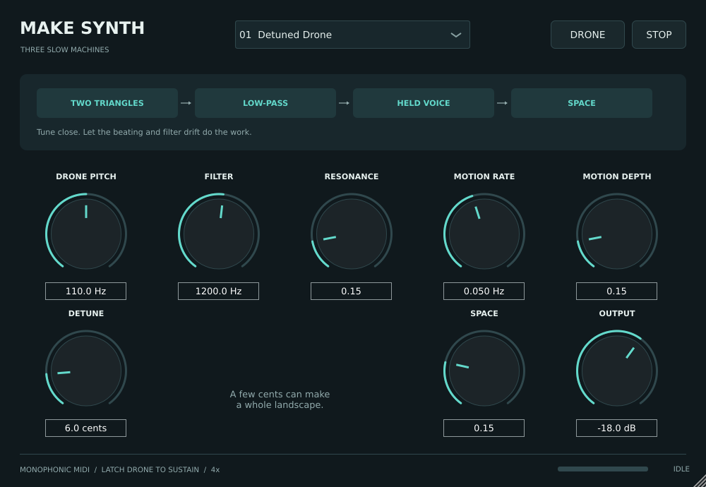

# Make Synth

Three drone/noise patches in one knob-driven **VST3 instrument** for Linux and
macOS. Choose Detuned Drone, Breathing Noise, or Metallic Drone from the menu.
The original modular patch diagrams remain alongside the plugin source.



## Play

1. Install the whole `Make Synth.vst3` bundle as described in [QUICKSTART.md](QUICKSTART.md).
2. Add **Make Synth** to a stereo instrument/MIDI track in a VST3 host.
3. Press **DRONE** for continuous sound, or play MIDI notes. A fresh instance
   starts silent, with output at -18 dB.
4. Turn the knobs. **STOP** clears the held voice, MIDI notes, and reverb tail.

| Mode | Sound | Main controls |
| --- | --- | --- |
| Detuned Drone | Two triangle oscillators, beating slowly through a moving low-pass filter | Pitch, Detune, Filter, Motion |
| Breathing Noise | Pink or white noise through a band-pass filter and slow amplitude swells | Noise colour, Filter, Breathing, Motion |
| Metallic Drone | A sine pair with linear FM, filtered and gently drifting | Pitch, FM Ratio, FM Depth, Filter |

All modes share resonance, modulation rate/depth, stereo reverb (**Space**),
and output level. The mode menu changes the signal path and visible controls;
it preserves knob settings. Parameters are automatable and saved with the DAW
session. This is a monophonic instrument with last-note priority, velocity,
per-channel sustain pedal, and +/-2-semitone pitch bend. MIDI pitch overrides
the Drone Pitch knob while a note is held. With Drone enabled, releasing MIDI
returns to the knob's pitch. Modulation runs freely and is not transport synced.

## Builds

The private repository's **Build VST3** GitHub Actions workflow produces:

- `MakeSynth-linux-x86_64`: Linux bundle, built on Ubuntu 22.04.
- `MakeSynth-macos-universal`: one macOS bundle containing arm64 and x86_64.

Download the matching artifact from a successful workflow run and extract the
inner zip. The Mac build uses ad-hoc signing and is not Apple notarized; see
[QUICKSTART.md](QUICKSTART.md) for installation. macOS deployment target is 11.0;
CI tests on macOS 15, not every older OS or DAW. Linux requires an x86_64 system
with glibc 2.35 or newer and the standard X11/font/OpenGL runtime libraries.
The local Ubuntu 26.04 build is specific to that newer system; use the CI
artifact for other distributions.

### Linux source build

Requires a C++17 compiler, CMake 3.24+, Make or Ninja, and development headers:

```sh
sudo apt install build-essential cmake pkg-config \
  libfreetype-dev libfontconfig1-dev libx11-dev libxcomposite-dev \
  libxcursor-dev libxext-dev libxinerama-dev libxrandr-dev \
  libxrender-dev libxi-dev libgl1-mesa-dev
cmake -S . -B build -DCMAKE_BUILD_TYPE=Release
cmake --build build --config Release --parallel 2
ctest --test-dir build --output-on-failure
```

The bundle is `build/MakeSynth_artefacts/Release/VST3/Make Synth.vst3`.
The host supplies audio-device I/O; the plugin does not need ALSA/JACK development
headers and does not install an audio server.

### macOS source build

Requires Xcode command-line tools and CMake 3.24+:

```sh
cmake -S . -B build -DCMAKE_BUILD_TYPE=Release \
  '-DCMAKE_OSX_ARCHITECTURES=arm64;x86_64' -DCMAKE_OSX_DEPLOYMENT_TARGET=11.0
cmake --build build --config Release --parallel 2
ctest --test-dir build --output-on-failure
```

The first configuration downloads JUCE 9.0.2, pinned to a commit and SHA-256 in
`CMakeLists.txt`. No credentials are needed. For an offline build, unpack that
exact JUCE revision and add `-DFETCHCONTENT_SOURCE_DIR_JUCE=/path/to/JUCE`.

## Validation and audio examples

`ctest` exercises pitch, silence/release, finite audio at extreme settings,
DC removal, MIDI offsets/sustain, varying block sizes, sample-rate changes,
panic, and preset recall. CI also runs pluginval level 5 against the actual
VST3 bundle; the Mac binary is validated on both native architectures.

```sh
build/MakeSynthRender_artefacts/Release/MakeSynthRender --render renders
build/MakeSynthRender_artefacts/Release/MakeSynthRender --snapshot docs
python3 Tools/package.py --build build --platform linux-x86_64 --output dist
```

The renderer writes three 12-second stereo 24-bit WAV examples without playing
audio. Snapshot capture requires a graphical session on Linux. DSP-only checks
can run without JUCE: configure with `-DMAKE_SYNTH_BUILD_PLUGIN=OFF`.
Host tests do not replace listening and checking the controls in your DAW.

The audio path uses 4x oversampling, smoothed controls and mode transitions,
DC removal, and a bounded output. MIDI and synthesis use fixed storage during
processing. Reverb and oversampling buffers are allocated during preparation.

## Original modular designs

- [Three patch diagrams (PDF)](modular-drone-patches.pdf)
- [Patch guide and starting settings](PATCH-GUIDE.md)
- Editable SVGs and PNG previews for all three designs
- `patch-connections.json`: the diagram connections
- `draw_patches.py`: diagram generator (requires Pillow)
- `modular-drone-patch-pack.zip`: the original complete patch bundle

No hardware board has been selected and no embedded firmware has been written.
The VST3 is the playable software implementation.

## Dependencies

See [THIRD_PARTY.md](THIRD_PARTY.md) and `Licenses/`. JUCE 9 uses dual
AGPLv3/commercial licensing. No JUCE commercial entitlement or Apple Developer
signing identity is assumed by this project. Keep those dependency terms in
mind before distributing the plugin outside this private workspace.
